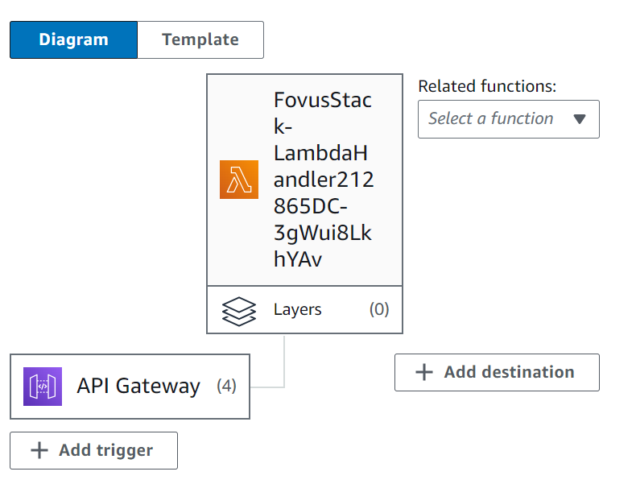
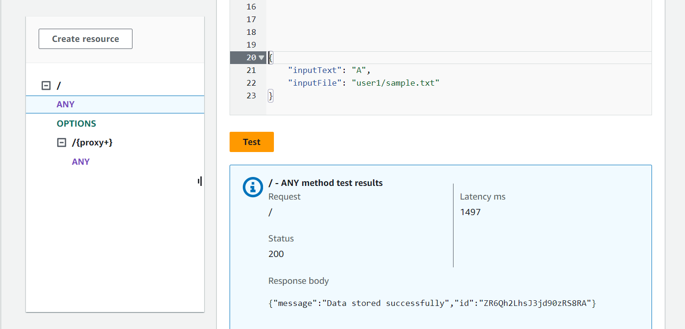
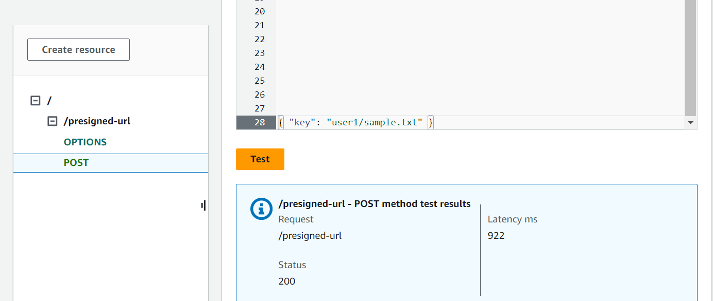
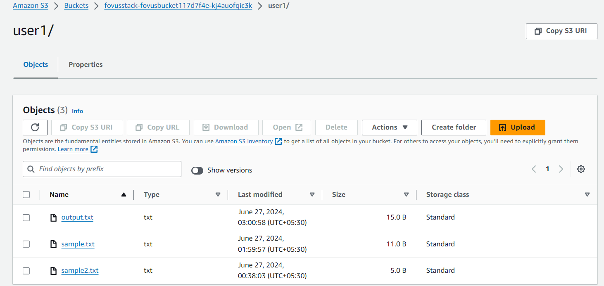
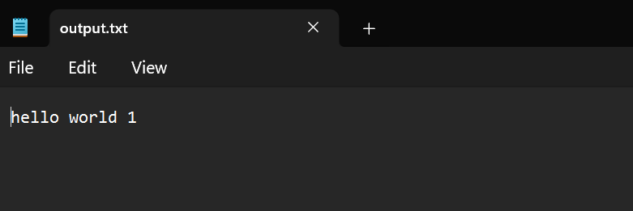
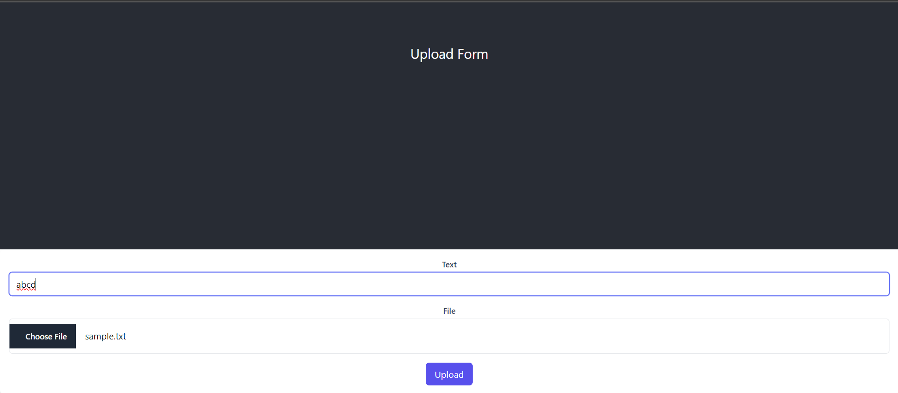

# AWS Full Stack Application

## Welcome!

This full-stack web application is integrated with Amazon AWS.

### Description:

I began by utilizing Amazon AWS CDK to establish the core infrastructure for my application. Permissions were configured through both the AWS Management Console and AWS CDK commands. The key resources include:

1. **S3 Bucket (`fovusstack-fovusbucket117d7f4e-kj4auofqic3k`):**
    - Used to store user-uploaded files.

2. **Lambda Function (`LambdaHandler`):**
    - Manages file metadata upon user upload.
    - Logs input text and file location to DynamoDB.

   

3. **DynamoDB Table:**
    - Stores metadata of uploaded files.
    - Fields include `FileLocation` (e.g., `user1/{filename}`) and `inputText`.

4. **Lambda Function (`StreamHandler`):**
    - Creates an EC2 instance upon database insertion.
    - Copies file contents from S3, appends text length, and updates the file in S3.
    - Monitors instance status until output file creation.
    - Specialized metadata checks ensure file completion before terminating the instance.

5. **Lambda Function (`PreSignedUrlLambda`):**
    - Provides a pre-signed URL to clients (React App) for secure file uploads to S3.

6. **EC2 Instance:**
    - Invoked by `StreamHandler` for file processing.
    - Terminated upon successful output file creation.

7. **API Gateway Rest APIs:**
    - One for providing pre-signed URLs.
    - Another for `LambdaHandler`.

### Steps to Reproduce:

To replicate the setup:

1. **Backend Setup:**
    - Navigate to the `Backend` folder.
    - Initialize with `cdk init`.
    - Configure regions (set as `ap-south-1`) and account permissions (AWS administrator role required).
    - Deploy using `cdk deploy`.

   Test API links via the API Gateway console.

2. **Testing LambdaHandler:**
    - Method: POST
    - URL: `https://yi57pl0p58.execute-api.ap-south-1.amazonaws.com/prod/`
    - Sample Body: `{"inputText":"A","inputFile":"user1/sample.txt"}`

   

   This triggers `StreamHandler` upon DB insertion, generating an output file in S3 after approximately one minute.

3. **Testing StreamHandler:**
    - Method: POST
    - URL: `https://r6bt88y1d7.execute-api.ap-south-1.amazonaws.com/prod/presigned-url`
    - Sample Body: `{"key":"user1/sample.txt"}`

   

### Frontend Setup:

1. **Navigate to the Frontend folder.**
2. Install dependencies with `npm install`.
3. Start the application with `npm start`.

Access the hosted [Amplify version of the app](https://main.d12wxi4pqv7j46.amplifyapp.com/).

### Output Screenshots:

### UI Screenshot:

---

**Email-ID:** nrajadhyaksha@ucsd.edu / rajadhyakshanishant@gmail.com
